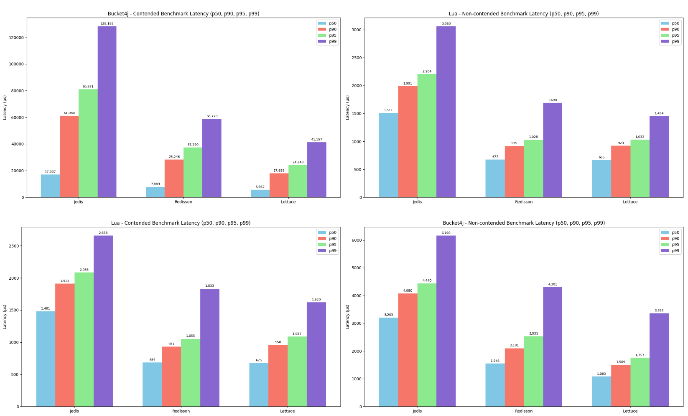
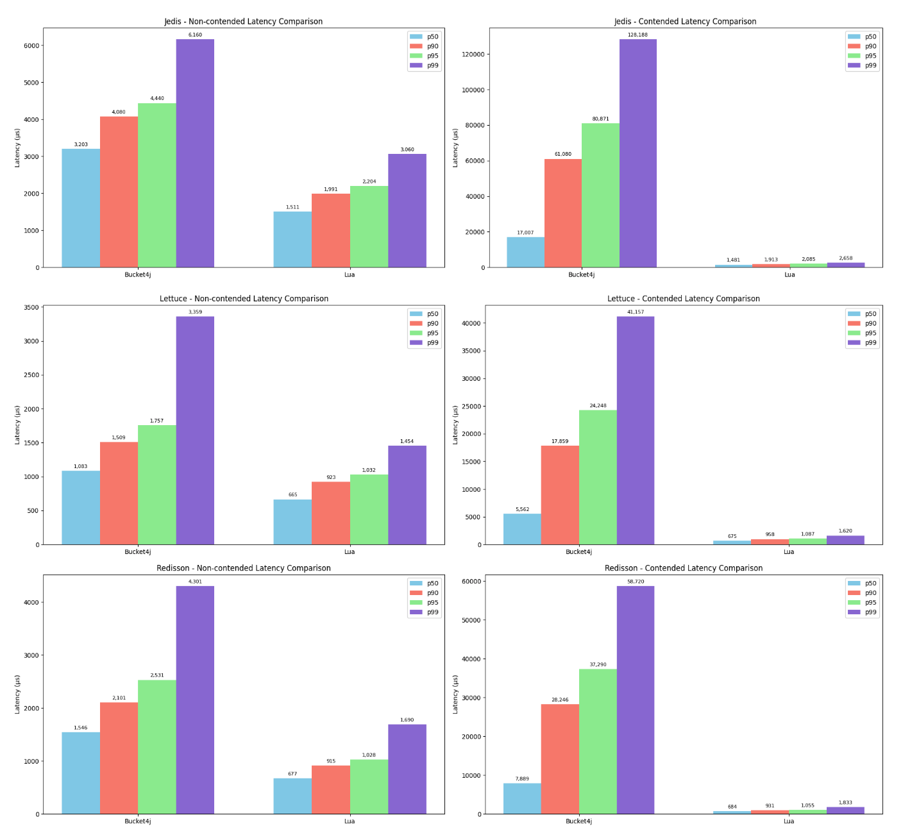

# Redis Token Bucket Benchmarks
This repository contains benchmark tests comparing different approaches to implement token bucket rate limiting using Redis.
Evaluate Bucket4j, Lua script execution, and several Redis client libraries (Jedis, Lettuce, Redisson) under controlled conditions using JMH.

## 🔍 Overview
This benchmark suite measures performance characteristic(latency percentiles) across different client libraries and implementations:
```text
- Bucket4j (distributed via Redis)
- Custom Lua script
- Clients tested:
  - Jedis 
  - Lettuce 
  - Redisson
```

## ⚙️ Benchmark Environment
- Apple M1, 10 CPUs
- JDK 17
- Redis 7.2.1 standalone, loopback(localhost)
- Bucket spec: 5,000 tokens (refills greedily 5,000 tokens per 1s)

## 📊 Metrics
### Latency (μs)


<hr />

### Latency Comparison

